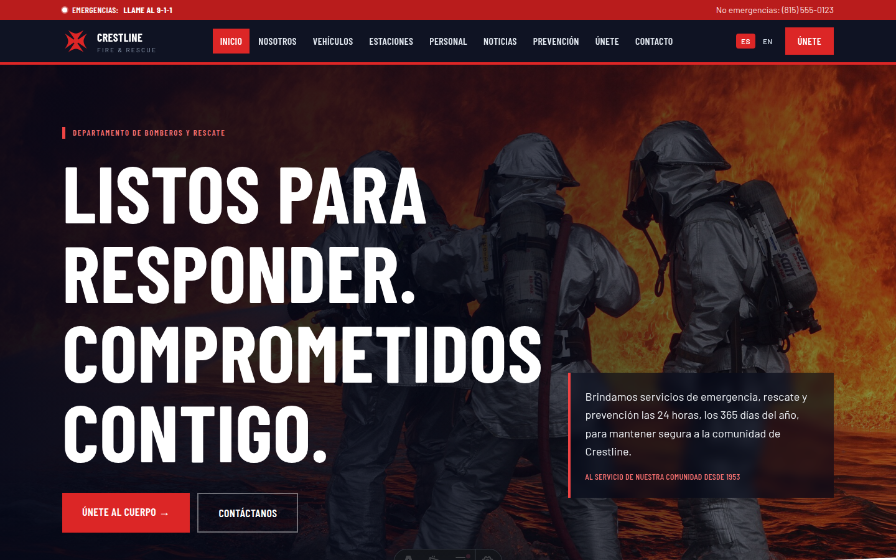
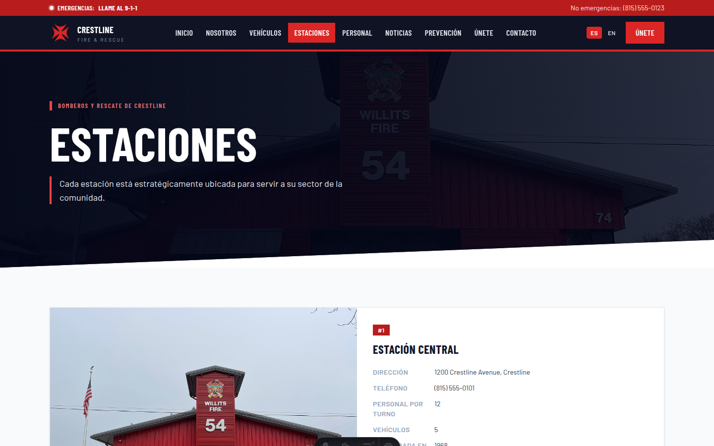
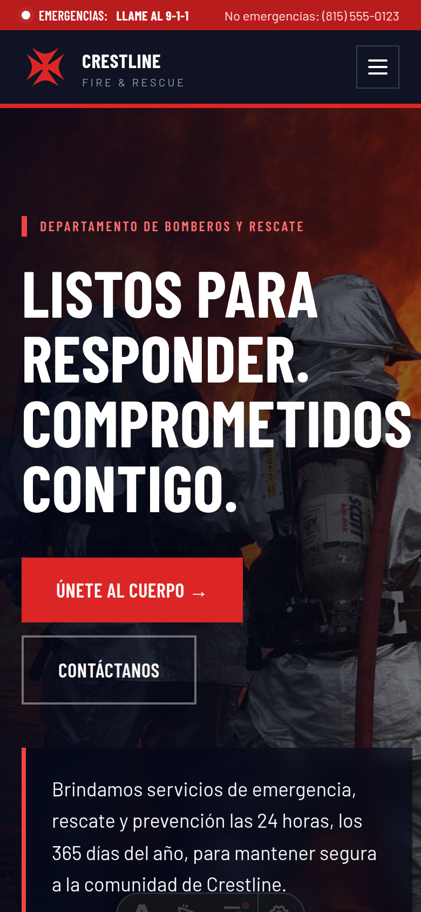

<h1 align="center">🚒 Crestline Fire & Rescue</h1>

<p align="center"><strong>Institutional fire-department site — civic art direction with a hand-built SVG data dashboard.</strong></p>

<p align="center">
  
  
  
</p>

<p align="center">
  
</p>

## ✨ Highlights

- 📊 **Calls dashboard** — incident statistics rendered as hand-built SVG charts (no chart library), straight from structured data.
- 🏛️ **Civic aesthetic** — bold condensed type, duty-red accents and photography-driven sections that feel like a real public institution.
- 🧑‍🚒 **Full institutional structure** — stations, apparatus, personnel, recruitment and safety-education sections.
- ⚡ **Astro static output** — fast, accessible, zero-JS by default.

## 🚀 Quick start

```bash
npm install
npm run dev       # http://localhost:4321
npm run build     # static production build
```

## 📸 Screens

| Dashboard & sections | Mobile |
|---|---|
|  |  |

---

<p align="center">Built by <a href="https://github.com/joansaro">Andrés Santos</a> · <a href="https://joansaro.com">joansaro.com</a></p>
